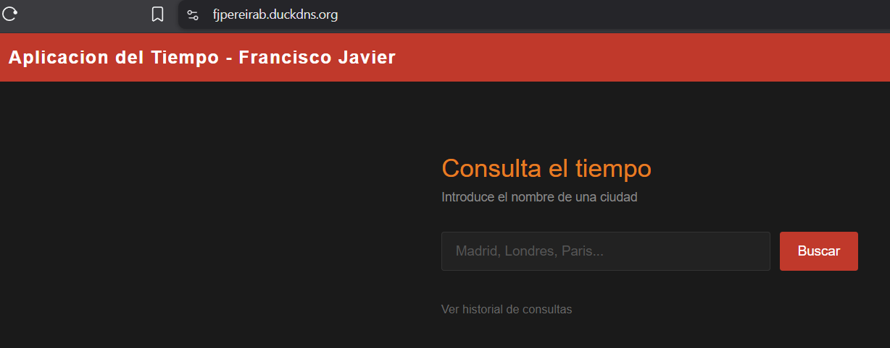
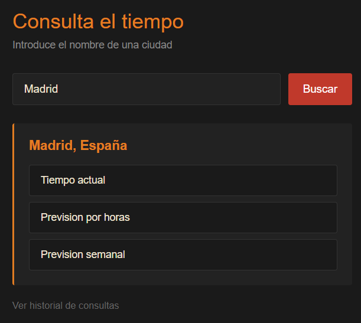
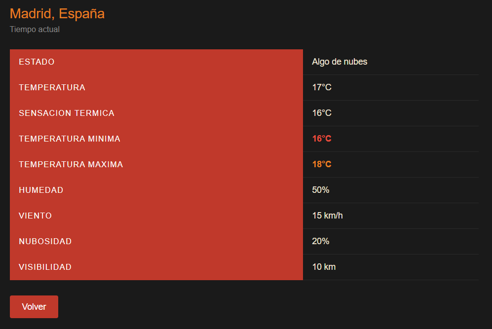
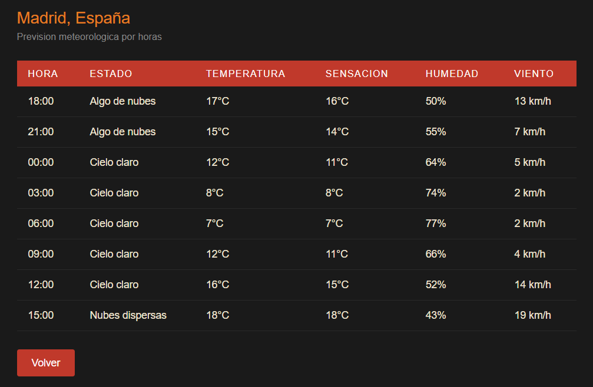
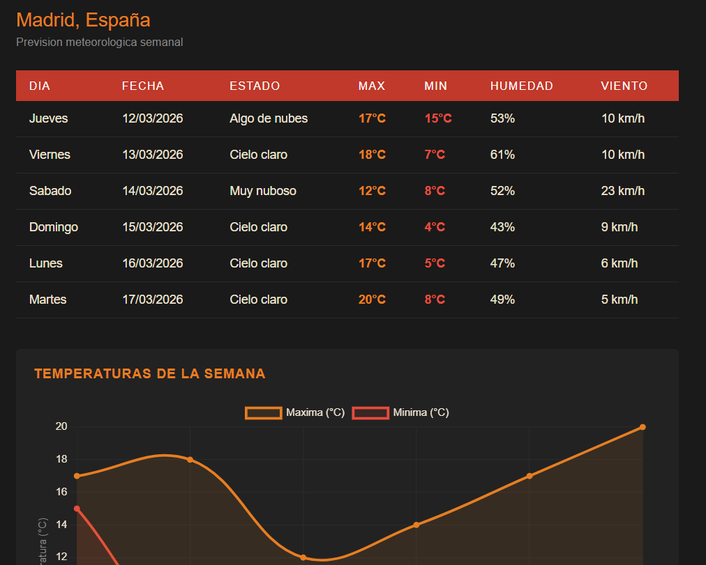
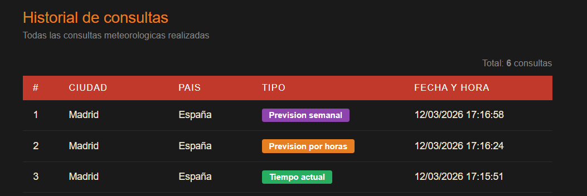

# Aplicación del Tiempo - Francisco Javier

Aplicación web desarrollada en PHP que permite consultar el tiempo atmosférico de cualquier ciudad del mundo utilizando la API de OpenWeatherMap. Desplegada en AWS con Docker y accesible desde internet mediante HTTPS.

**URL de acceso:** https://fjpereirab.duckdns.org  
**Repositorio:** https://github.com/fjpereirab01/aplicacion-tiempo-franciscojavier

---

## Índice

- [Introducción](#introducción)
- [Estructura del proyecto](#estructura-del-proyecto)
- [Explicación de archivos](#explicación-de-archivos)
  - [Dockerfile](#dockerfile)
  - [docker-compose.yml](#docker-composeyml)
  - [sql/init.sql](#sqlinitsql)
  - [src/configuracion/config.php](#srcconfiguracionconfigphp)
  - [src/modelos/Modelo.php](#srcmodelosmodelophp)
  - [src/controladores/TiempoControlador.php](#srccontroladorestiempocontroladorphp)
  - [src/vistas/paginas.php](#srcvistaspaginasphp)
  - [src/vistas/vistas.php](#srcvistasvistasphp)
  - [src/index.php](#srcindexphp)
- [Tecnologías utilizadas](#tecnologías-utilizadas)
- [Instalación en local](#instalación-en-local)
- [Comprobación](#comprobación)
- [Conclusión](#conclusión)

---

## Introducción

Esta aplicación ha sido desarrollada como práctica de la asignatura IAPLW del ciclo ASIR2. El objetivo es crear una aplicación web en PHP que consulte datos meteorológicos a través de una API externa, los almacene en una base de datos MariaDB y los muestre al usuario de forma clara.

La aplicación sigue el patrón de diseño **MVC (Modelo Vista Controlador)**, separando la lógica de negocio, el acceso a datos y la presentación en capas independientes. El despliegue se realiza mediante **Docker** en una instancia **EC2 de AWS**, con **Nginx** como proxy inverso y certificado **SSL gratuito** obtenido con Certbot y DuckDNS.

---

## Estructura del proyecto

```
aplicacion_tiempo/
├── Dockerfile                  # Imagen Docker de PHP + Apache
├── docker-compose.yml          # Orquestación de contenedores
├── apache/
│   └── 000-default.conf        # Configuración de Apache
├── nginx/
│   └── nginx.conf              # Configuración de Nginx (proxy inverso + HTTPS)
├── sql/
│   └── init.sql                # Script de creación de la base de datos
├── imagenes/                   # Capturas de pantalla de la aplicación
└── src/
    ├── index.php               # Punto de entrada de la aplicación
    ├── configuracion/
    │   └── config.php          # API key y configuración de la base de datos
    ├── modelos/
    │   └── Modelo.php          # Acceso a la base de datos (ciudades y consultas)
    ├── controladores/
    │   └── TiempoControlador.php # Lógica de negocio y llamadas a la API
    └── vistas/
        ├── paginas.php         # Enrutador de vistas
        └── vistas.php          # Todas las páginas HTML de la aplicación
```

---

## Explicación de archivos

### Dockerfile
Define la imagen Docker que se usa para el contenedor PHP + Apache.

```dockerfile
FROM php:8.2-apache
# Imagen base oficial de PHP 8.2 con Apache incluido

RUN apt-get update && apt-get install -y \
    libpng-dev \
    libjpeg-dev \
    libfreetype6-dev \
    # Instalamos las dependencias necesarias para trabajar con imágenes
    && docker-php-ext-configure gd --with-freetype --with-jpeg \
    && docker-php-ext-install gd pdo pdo_mysql mysqli
    # Instalamos extensiones PHP:
    # - gd: para generar gráficas
    # - pdo, pdo_mysql: para conectar con MariaDB usando PDO
    # - mysqli: conexión alternativa con MariaDB

RUN a2enmod rewrite
# Activamos el módulo rewrite de Apache para permitir redirecciones

COPY apache/000-default.conf /etc/apache2/sites-enabled/000-default.conf
# Copiamos nuestra configuración personalizada de Apache

EXPOSE 80
# El contenedor escucha en el puerto 80
```

---

### docker-compose.yml
Orquesta los cuatro contenedores de la aplicación.

```yaml
services:
  php:
    build: .
    # Construye la imagen usando el Dockerfile
    container_name: aplicacion_tiempo
    volumes:
      - ./src:/var/www/html
      # Monta la carpeta src como raíz del servidor web
    depends_on:
      - db
      # Espera a que la base de datos arranque primero
    environment:
      DB_HOST: db
      DB_NAME: weatherapp
      DB_USER: weatheruser
      DB_PASS: weatherpass
      # Variables de entorno para conectar con la base de datos

  db:
    image: mariadb:10.11
    # Imagen oficial de MariaDB versión 10.11
    container_name: base_datos_tiempo
    restart: always
    # Se reinicia automáticamente si falla
    volumes:
      - ./sql/init.sql:/docker-entrypoint-initdb.d/init.sql
      # Script SQL que se ejecuta al crear la base de datos
      - db_data:/var/lib/mysql
      # Volumen para que los datos persistan

  nginx:
    image: nginx:alpine
    container_name: nginx_tiempo
    ports:
      - "80:80"
      - "443:443"
      # Expone los puertos HTTP y HTTPS
    volumes:
      - ./nginx/nginx.conf:/etc/nginx/conf.d/default.conf
      - ./certbot/conf:/etc/letsencrypt
      # Certificados SSL generados por Certbot
      - ./certbot/www:/var/www/certbot
      # Directorio de verificación de Certbot

  certbot:
    image: certbot/certbot
    # Gestiona el certificado SSL gratuito de Let's Encrypt
    volumes:
      - ./certbot/conf:/etc/letsencrypt
      - ./certbot/www:/var/www/certbot
```

---

### sql/init.sql
Script SQL que crea las tablas de la base de datos automáticamente al arrancar el contenedor.

```sql
USE weatherapp;

-- Tabla ciudades: guarda las ciudades buscadas
CREATE TABLE IF NOT EXISTS ciudades (
    id INT AUTO_INCREMENT PRIMARY KEY,  -- Identificador único
    nombre VARCHAR(100) NOT NULL,       -- Nombre de la ciudad
    pais VARCHAR(10) NOT NULL,          -- Código del país (ej: ES)
    lat DECIMAL(9,6) NOT NULL,          -- Latitud
    lon DECIMAL(9,6) NOT NULL,          -- Longitud
    created_at TIMESTAMP DEFAULT CURRENT_TIMESTAMP -- Fecha de búsqueda
);

-- Tabla consultas: guarda cada consulta meteorológica
CREATE TABLE IF NOT EXISTS consultas (
    id INT AUTO_INCREMENT PRIMARY KEY,
    ciudad_id INT NOT NULL,             -- Ciudad consultada
    tipo ENUM('actual','horas','semana') NOT NULL, -- Tipo de consulta
    respuesta_json LONGTEXT,            -- Respuesta completa de la API
    created_at TIMESTAMP DEFAULT CURRENT_TIMESTAMP,
    FOREIGN KEY (ciudad_id) REFERENCES ciudades(id)
);
```

---

### src/configuracion/config.php
Contiene la API key de OpenWeatherMap y la configuración de conexión a la base de datos.

```php
define('API_KEY', 'TU_API_KEY');
// Clave de acceso a la API de OpenWeatherMap

define('API_BASE_URL', 'https://api.openweathermap.org');
// URL base de la API

define('API_LANG', 'es');
// Idioma de los resultados en español

define('API_UNITS', 'metric');
// Unidades de temperatura en Celsius

define('DB_HOST', getenv('DB_HOST') ?: 'db');
// Host de la base de datos, lee la variable de entorno del docker-compose

define('DB_NAME', getenv('DB_NAME') ?: 'weatherapp');
define('DB_USER', getenv('DB_USER') ?: 'weatheruser');
define('DB_PASS', getenv('DB_PASS') ?: 'weatherpass');
```

---

### src/modelos/Modelo.php
Clase DAO que gestiona todas las operaciones con la base de datos.

```php
class Modelo {
    private $conexion;
    // Conexión PDO con la base de datos

    public function __construct() {
        $this->conexion = new PDO(...);
        // Establece la conexión al instanciar la clase
    }

    public function guardarCiudad($ciudad) {
        // Comprueba si la ciudad ya existe en la BD
        // Si no existe la inserta y devuelve el nuevo id
        // Si existe devuelve el id existente
    }

    public function guardarConsulta($ciudadId, $tipo, $respuestaJson) {
        // Inserta una nueva consulta meteorológica en la BD
        // Guarda el JSON completo de la respuesta de la API
    }

    public function obtenerTodasConsultas() {
        // Devuelve todas las consultas ordenadas por fecha descendente
        // Hace un JOIN con la tabla ciudades para obtener el nombre
    }
}
```

---

### src/controladores/TiempoControlador.php
Controlador principal que gestiona la lógica de negocio y las llamadas a la API.

```php
class TiempoControlador {
    private $modelo;
    // Instancia del modelo para acceder a la base de datos

    public function buscarCiudades($nombreCiudad) {
        // Llama a la API de geocodificación de OpenWeatherMap
        // Devuelve hasta 5 ciudades con ese nombre
        // Traduce los códigos de país al español
    }

    public function guardarCiudad($ciudad) {
        // Delega en el modelo para guardar la ciudad en la BD
    }

    public function obtenerTiempoActual($ciudadId, $lat, $lon) {
        // Llama al endpoint /data/2.5/weather de la API
        // Guarda la consulta en la BD
        // Devuelve los datos formateados para la vista
    }

    public function obtenerPrevisionHoras($ciudadId, $lat, $lon) {
        // Llama al endpoint /data/2.5/forecast con cnt=8
        // Devuelve previsiones cada 3 horas para el día actual
    }

    public function obtenerPrevisionSemanal($ciudadId, $lat, $lon) {
        // Llama al endpoint /data/2.5/forecast
        // Agrupa los datos por día calculando máximas y mínimas
        // Traduce los días de la semana al español
    }

    public function obtenerHistorial() {
        // Delega en el modelo para obtener todas las consultas
    }

    private function llamarApi($url) {
        // Método privado que hace las peticiones HTTP a la API
        // Usa file_get_contents con un timeout de 10 segundos
    }
}
```

---

### src/vistas/paginas.php
Enrutador de vistas. Recibe el parámetro `vista` de la URL y llama a la función correspondiente.

```php
$vista = $_GET['vista'] ?? 'actual';
// Lee el parámetro vista de la URL

switch ($vista) {
    case 'actual':    vistaActual($ciudad, $datos);   break;
    case 'horas':     vistaHoras($ciudad, $datos);    break;
    case 'semana':    vistaSemana($ciudad, $datos);   break;
    case 'historial': vistaHistorial($datos);         break;
}
// Según el valor del parámetro muestra una página u otra
```

---

### src/vistas/vistas.php
Contiene todas las funciones de presentación HTML de la aplicación.

```php
function mostrarCabecera($titulo) { ... }
// Genera el HTML común de todas las páginas (head, estilos, header)

function mostrarPiePagina() { ... }
// Cierra las etiquetas HTML

function vistaActual($ciudad, $datos) { ... }
// Muestra los datos meteorológicos actuales en una tabla

function vistaHoras($ciudad, $horas) { ... }
// Muestra la previsión por horas en una tabla

function vistaSemana($ciudad, $dias) { ... }
// Muestra la previsión semanal en una tabla con gráfica de temperaturas

function vistaHistorial($consultas) { ... }
// Muestra todas las consultas realizadas con badges de colores
```

---

### src/index.php
Punto de entrada de la aplicación. Gestiona el formulario de búsqueda y la sesión del usuario.

```php
session_start();
// Inicia la sesión para guardar los datos de la ciudad seleccionada

// Si el usuario selecciona una ciudad de la lista:
// - Guarda los datos en sesión
// - Redirige con header() para evitar reenvío del formulario

// Si el formulario se envía:
// - Llama al controlador para buscar ciudades
// - Si hay una sola ciudad la selecciona automáticamente
// - Si hay varias muestra una lista para que el usuario elija
// - Si no se encuentra muestra un mensaje de error
```

---

## Tecnologías utilizadas

- **PHP 8.2** con Apache — backend y lógica de la aplicación
- **MariaDB 10.11** — base de datos para guardar ciudades y consultas
- **Docker + Docker Compose** — contenedores para el despliegue
- **Nginx** — proxy inverso con soporte HTTPS
- **Certbot + Let's Encrypt** — certificado SSL gratuito
- **DuckDNS** — dominio gratuito para acceso desde internet
- **AWS EC2 t3.micro** — servidor en la nube
- **OpenWeatherMap API** — datos meteorológicos
- **Chart.js** — gráfica de temperaturas semanales
- **Patrón MVC** — arquitectura de la aplicación

---

## Instalación en local

1. Clona el repositorio:
```bash
git clone https://github.com/fjpereirab01/aplicacion-tiempo-franciscojavier.git
cd aplicacion-tiempo-franciscojavier
```

2. Copia el archivo de configuración y añade tu API key:
```bash
cp src/configuracion/config.example.php src/configuracion/config.php
```

3. Edita `src/configuracion/config.php` y añade tu API key de OpenWeatherMap.

4. Arranca los contenedores:
```bash
docker-compose up -d --build
```

5. Accede en el navegador: `http://localhost:8080`

---

## Comprobación

### Página principal


### Selección de ciudad


### Tiempo actual


### Previsión por horas


### Previsión semanal con gráfica


### Historial de consultas


---

## Conclusión

La aplicación cumple con todos los requisitos de la práctica:

- Búsqueda de ciudades con selección múltiple cuando hay varias ciudades con el mismo nombre
- Consulta del tiempo actual, por horas y semanal usando la API de OpenWeatherMap
- Almacenamiento de todas las consultas en una base de datos MariaDB usando el patrón DAO
- Gráfica de temperaturas semanales con Chart.js
- Historial de todas las consultas realizadas
- Despliegue en AWS EC2 con Docker accesible desde internet mediante HTTPS
- Arquitectura MVC para una mejor organización del código
- Dominio gratuito con DuckDNS y certificado SSL con Let's Encrypt

**URL de acceso:** https://fjpereirab.duckdns.org  
**Repositorio GitHub:** https://github.com/fjpereirab01/aplicacion-tiempo-franciscojavier
